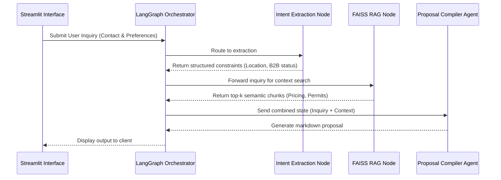

# CreativeSync: Automated Photography Proposal Generator
**Module:** IT41043 - Intelligent Systems (Agentic AI)

## 1. Overview
CreativeSync is an agentic AI system designed specifically for a freelance photography studio. It automates client inquiries, equipment selection, lighting configuration advice, shoot planning, and knowledge retrieval using a Retrieval-Augmented Generation (RAG) pipeline. The application grounds its outputs in a custom domain-specific knowledge base containing business terms, pricing structures, and regional location logistics across Sri Lanka.

**Live Application:** https://creativesync-agent.streamlit.app/

## 2. Project Architecture

```text
CreativeSync/
├── src/
│   ├── agents/          # Autonomous agent workflows (booking, proposal compiler)
│   └── utils/           # Helper utilities, logger, environment loader
├── data/                # Knowledge base text documents (knowledge_base.txt) and FAISS index
├── app.py               # Streamlit application and LangGraph orchestrator
├── build_rag.py         # Script to chunk text and generate the local FAISS vector store
├── .env.example         # Template for environment variables and API keys
├── .gitignore           # Exclusions for security secrets & Python build caches
├── requirements.txt     # Python package dependencies
└── README.md            # Project documentation
```

## 3. System Architecture & Agent Communication
The system utilizes LangGraph to facilitate structured communication between distinct agents. Data is passed through a shared `AgentState` TypedDict, which maintains the conversational context, extracted client constraints, retrieved RAG context, and the final compiled proposal.



## 4. Agentic Design Patterns
The application implements three distinct agentic design patterns to manage logical flow and context:

1. **Orchestrator-Worker Pattern:** Managed by LangGraph. The main graph orchestrates the flow of data, routing input to the intent parser, triggering external retrieval, and passing all accumulated state to the final generation worker.
2. **Tool-Use (External Retrieval):** The RAG implementation acts as a specialized tool node (`rag_retrieval_node`). The system pauses generation to execute a similarity search against a local vector database, retrieving factual constraints before continuing.
3. **Prompt Chaining / Sequential Processing:** The output of one node strictly dictates the behavior of the next. The extracted location intent is chained into the similarity search query, and the retrieved context is chained into the compiler's system prompt.

## 5. Model Selection Strategy
Different sub-tasks require different computational capabilities. Models were selected to balance latency, cost, and reasoning quality.

| Sub-task | Model (Provider) | Justification |
| :--- | :--- | :--- |
| **Intent Routing & Extraction** | Llama 3 8B (Groq) | Extremely low latency and near-zero cost. Sufficient for basic text extraction and classification. |
| **Final Proposal Synthesis** | Llama 3 70B (Groq) / Claude 3 Haiku (OpenRouter) | Higher reasoning capability and larger context window required to synthesize raw RAG chunks into a cohesive professional markdown proposal without formatting errors. |
| **Retrieval Embeddings** | all-MiniLM-L6-v2 (HuggingFace) | Fast, local embedding execution with zero API cost. The 384-dimensional vectors efficiently rank the local domain corpus. |

## 6. RAG Integration & Evaluation
To prevent hallucinations regarding pricing and municipal permit fees, the application integrates a RAG pipeline.

* **Corpus:** Domain-specific policy sections covering freelance rates, terms of service, and location logistics for areas including Colombo, Kandy, and Galle.
* **Chunking Strategy:** `RecursiveCharacterTextSplitter` utilized with a `chunk_size` of 500 and `chunk_overlap` of 50 to maintain intact location paragraphs without diluting semantic meaning.
* **Vector Store:** Local FAISS index.
* **Retrieval Evaluation:** Tested against specific geographic queries to successfully retrieve correct municipal permit costs and time recommendations, overriding generic fallback responses.

## 7. Getting Started (Installation & Setup)

**Prerequisites**
* Python 3.9+ installed
* Git installed

1. **Clone the Repository**:
   ```bash
   git clone [https://github.com/minzilu/CreativeSync.git](https://github.com/minzilu/CreativeSync.git)
   cd CreativeSync
   ```

2. **Set Up Virtual Environment**:
   ```bash
   python -m venv .venv
   # On Windows (PowerShell):
   .\.venv\Scripts\Activate.ps1
   # On macOS/Linux:
   source .venv/bin/activate
   ```

3. **Install Dependencies**:
   ```bash
   pip install -r requirements.txt
   ```

4. **Configure Environment Variables**:
   Copy `.env.example` to `.env` and configure your API credentials:
   ```bash
   cp .env.example .env
   ```

5. **Build the RAG Vector Database**:
   ```bash
   python build_rag.py
   ```

6. **Run the Application**:
   ```bash
   streamlit run app.py
   ```

## 8. Branch Strategy & Security
* **Branching:** `main` serves production-ready code. `feature/rag-pipeline` handles active development for document chunking, embedding, and vector database retrieval.
* **Security:** All API keys and credentials are automatically excluded via `.gitignore`. Never commit `.env` or sensitive key files to version control.
